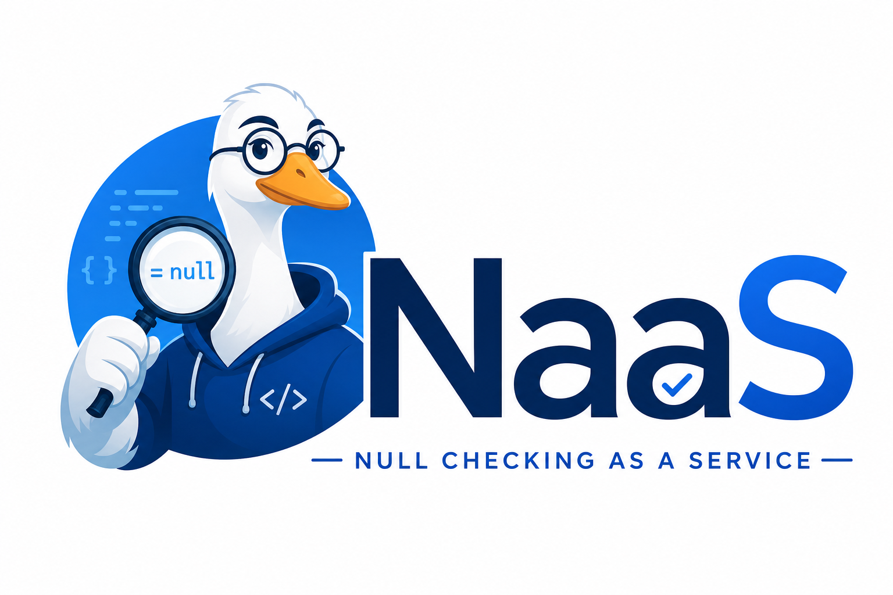

<p align="center"> 
  
</p>

# Null Checking Service

A Rust service that provides null checking via an HTTP API.

## Features

- Exposes a `POST` endpoint at `/check` for null checking operations.
- Provides Swagger UI at `/swagger-ui`.
- Exposes the OpenAPI specification JSON at `/api-docs/openapi.json`.
- Supports port configuration through the `PORT` environment variable.
- Can be deployed using the included Helm charts.

## API Endpoints

| Endpoint | Purpose |
|---------|---------|
| `/check` | Performs the null checking operation |
| `/swagger-ui` | Serves the Swagger UI for interactive API exploration |
| `/api-docs/openapi.json` | Serves the OpenAPI JSON specification |

## Configuration

The application port can be configured with the `PORT` environment variable.

Example:

```bash
export PORT=8080
cargo run
